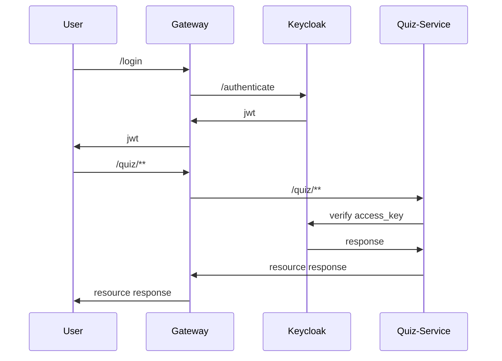

# [Imdb Quiz with oauth2 authentication](https://github.com/wgaalves/imdb-quiz/)

## What you'll build
- A simple spring cloud project with oath2 authentication

## What you'll need
- Docker CE

## Stack
- Docker
- docker-compose
- Java 11/77
- Spring Boot
- Spring cloud
- Keycloak
- Gradle

## Befor Run
- Run command `docker build ./gateway/ -t quiz/gateway -f gateway/Dockerfile`
- Run command `docker build ./quiz-service/ -t quiz/quiz-service -f quiz-service/Dockerfile`

## Run
- Run command `docker-compose up -d`

## Script After Run

- Run `keycloak.sh`
- login on keycloak admin  localhost:8888/auth/admin  
- go on clients and choose quiz-gateway and enable `Direct Access Grants`

## Documentation
- Swagger on `http://localhost:8060/quiz/swagger-ui/index.html`

## Sequence Diagram

